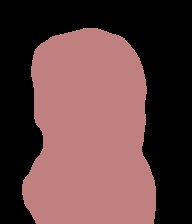
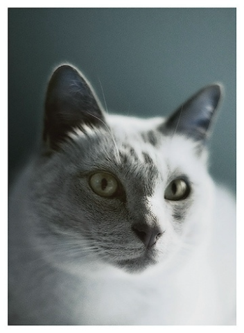
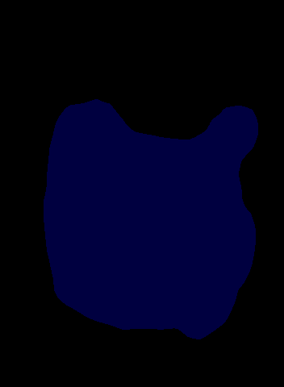
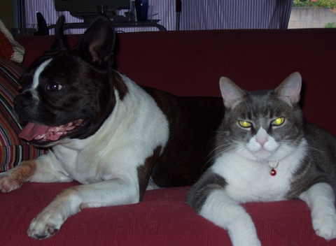
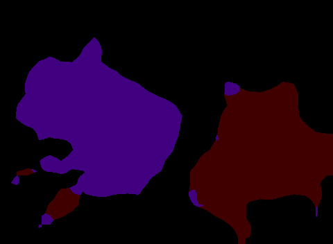
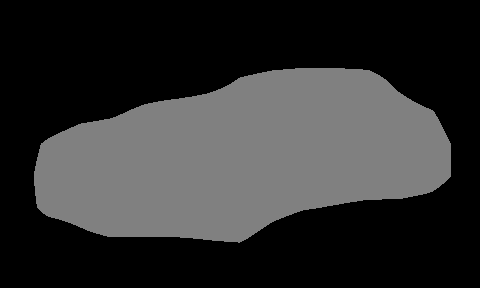
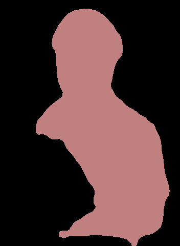
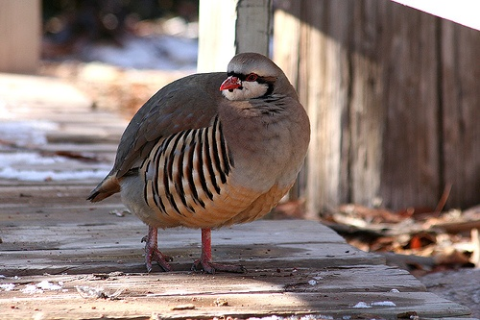
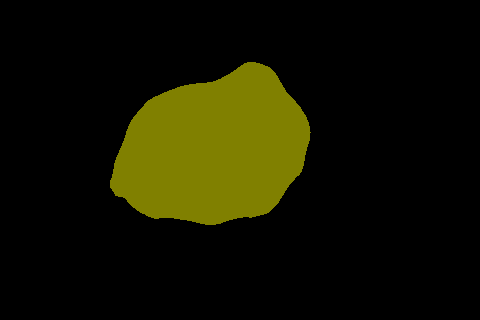

# Fully Convolutional Neural Network for Semantic Segmentation
----

Paper can be found [here](https://arxiv.org/abs/1411.4038).

(Just for fun, the result is not good)

Includes the ``tensorflow`` implementation of FCN (consists of FCN-32s, FCN-16s, FCN-8s).

**Usage:**

### Configuration

You need to set the configuration in the ``cfgs.py`` file to customize the model.

### Training

The ``model`` attribute in ``cfgs.py`` will determined the model used in FCN. Here, the backbone is ResNet-50.

Train new layer for 10 epochs, and then fine-tuning the model.

After setting all attributes, run ``train.py`` to train and save the model.

Notice that for training the model, we need to crop the image to the fixed size, here set the ``crop_size`` attribute in the ``cfgs.py``. The ``crop_size`` should be divisible by 32.

### Inference

To inference, the image resolution will be rounded to the nearest number divisible by 32.

Run the ``inference.py``.

### Evaluate

Specify the evaluation matrix attribute ``eval`` in the ``cfgs.py``. The attribute must be either:
- ``'pacc'``: pixel accuracy.
- ``'macc'``: mean accuracy.
- ``'mIU'``: mean intersection over union.
- ``'wIU'``: weighted intersection over union.

Run ``evaluation.py`` to evaluate the model.

### Result

Here are some results of the FCN:

|

|

|

|

|

|

|

The model is only good at capturing the dense part like body, but fails to capture other body part like arm, leg,...

Result on VOC2007 test set (only use 6 classes):

|Model|pixel acc|mean acc|mean IU|weighted IU|
|-----|---------|--------|-------|-----------|
|ResNet50-FCN32s|0.923|0.633|0.493|0.868|
|ResNet50-FCN16s|0.928|0.657|0.535|0.877|
|ResNet50-FCN8s|0.938|0.711|0.604|0.893|

-----

I'm trying to add ``Tensorboard`` for debugging and visualizing.
